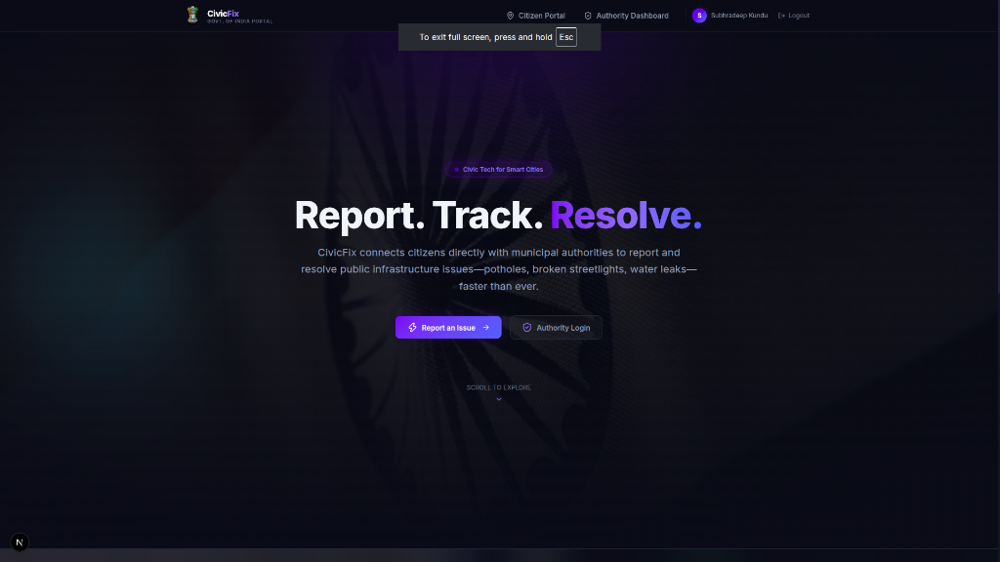
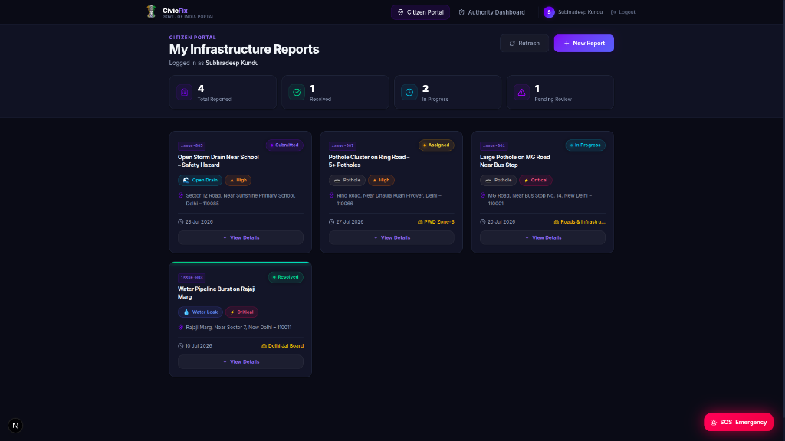
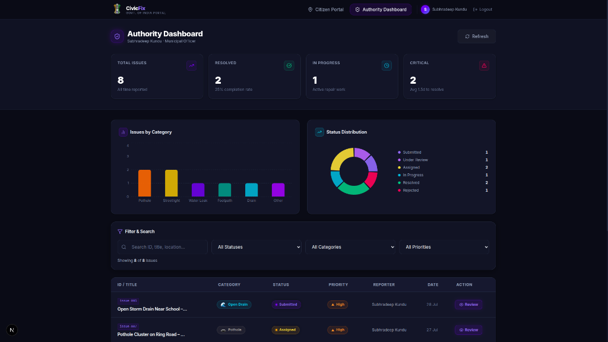
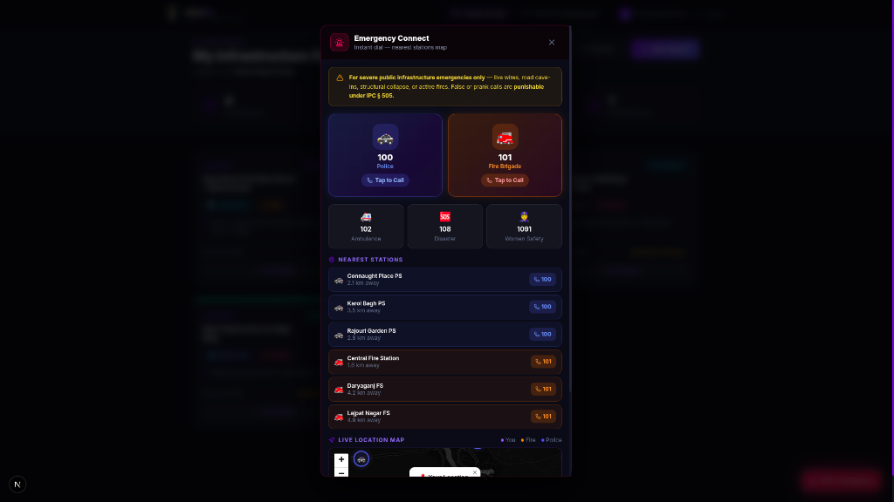

<div align="center">


# ⚡ CivicFix — Public Infrastructure Reporting Portal

**A full-stack civic-tech web application that bridges the gap between citizens and municipal authorities.**  
Report potholes, broken streetlights, water leaks, and other public infrastructure issues — and track them to resolution in real time.

[](https://nextjs.org)
[](https://www.typescriptlang.org)
[](https://tailwindcss.com)
[](https://react.dev)
[](https://leafletjs.com)
[](LICENSE)

[Live Demo](https://civicfix-one.vercel.app) · [Report a Bug](subhradeepkundu2005@gmail.com) · [Request a Feature](subhradeepkundu2005@gmail.com)

</div>

---

## 📋 Table of Contents

- [Overview](#-overview)
- [Key Features](#-key-features)
- [Tech Stack](#-tech-stack)
- [Project Structure](#-project-structure)
- [Getting Started](#-getting-started)
- [Pages & Routes](#-pages--routes)
- [API Reference](#-api-reference)
- [Design System](#-design-system)
- [Screenshots](#-screenshots)
- [Contributing](#-contributing)
- [License](#-license)

---

## 🌆 Overview

**CivicFix** is a government-grade civic infrastructure damage reporting platform built for Indian smart cities. It provides a seamless workflow for citizens to report issues and for municipal officers to triage, assign, and resolve them — all within a beautiful, dark-themed SaaS-quality interface.

The platform features a dual-portal system:
- **Citizen Portal** — Register, log in, submit geo-tagged reports, and track issue status.
- **Authority Dashboard** — Admins view analytics charts, filter/search all submitted issues, update statuses, and manage resolution workflows.

---

## ✨ Key Features

### 🏛️ Citizen Portal
| Feature | Description |
|---|---|
| **User Authentication** | Secure register/login system with role-based access control (citizen vs. admin) |
| **Issue Reporting** | Multi-field report form with category, priority, title, description, and location |
| **Geo-Tagged Location** | Interactive Leaflet map — click, drag pin, or use GPS auto-detect with reverse geocoding via Nominatim |
| **Photo Evidence Upload** | Attach photographic evidence (PNG/JPG, up to 5MB); stored as Base64 data URLs |
| **My Reports Dashboard** | Citizens can track all their submitted reports with live status updates |
| **Priority Selection** | 4-tier urgency system: Low · Medium · High · Critical |
| **Issue Categories** | Pothole 🕳️ · Streetlight 💡 · Water Leak 💧 · Footpath 🚶 · Open Drain 🌊 · Other ⚠️ |

### 🛡️ Authority Dashboard (Admin)
| Feature | Description |
|---|---|
| **KPI Analytics Cards** | Live count-up animated stats: Total Issues, Resolved, In-Progress, Critical |
| **Bar Chart — Category View** | Visual breakdown of issues by infrastructure category (Recharts) |
| **Pie Chart — Status Distribution** | Donut chart showing real-time status distribution with colour legend |
| **Advanced Filtering** | Filter by Status, Category, and Priority simultaneously |
| **Full-Text Search** | Search across issue ID, title, address, and reporter name |
| **Paginated Issue Table** | 8 issues per page with animated row transitions |
| **Issue Detail Modal** | Click any row to view full details and update issue status |
| **Status Lifecycle Management** | Submitted → Under Review → Assigned → In Progress → Resolved / Rejected |

### 🆘 Emergency Connect (SOS)
| Feature | Description |
|---|---|
| **Floating SOS Button** | Always-visible pulsing emergency button with animated glow effect |
| **One-Tap Quick Dial** | Direct `tel:` links for Police (100) and Fire Brigade (101) |
| **Secondary Emergency Numbers** | Ambulance (102) · Disaster Mgmt (108) · Women Safety (1091) |
| **Live Location Map** | Auto-detects GPS coordinates and renders nearest emergency stations on a dark Leaflet map |
| **Nearest Station Listing** | Displays 6 nearest police & fire stations with distance and direct call button |
| **IPC Warning Banner** | Legal notice: false/prank calls are punishable under IPC § 505 |

### 🎨 UI/UX
| Feature | Description |
|---|---|
| **Obsidian Dark Theme** | Deep charcoal (`#090D16`) background with electric indigo (`#6366F1`) accents |
| **Glassmorphism Cards** | Backdrop-blur glass cards with subtle border glow |
| **Framer Motion Animations** | Page transitions, card hover tilt/lift, count-up numbers, animated table rows |
| **Fully Responsive** | Mobile-first design — optimised for phones, tablets, and desktops |
| **Toast Notifications** | Styled React Hot Toast for success/error feedback |
| **Animated Statistics** | Count-up number animation triggered on viewport entry |

---

## 🛠️ Tech Stack

### Frontend
| Technology | Version | Purpose |
|---|---|---|
| [Next.js](https://nextjs.org) | 16.2 | React framework with App Router & API Routes |
| [React](https://react.dev) | 19.x | UI component library |
| [TypeScript](https://www.typescriptlang.org) | 5.x | Static type safety |
| [Tailwind CSS](https://tailwindcss.com) | 4.x | Utility-first styling |
| [Framer Motion](https://www.framer.com/motion/) | 12.x | Animations & page transitions |
| [Lucide React](https://lucide.dev) | 1.28 | Icon library |

### Mapping & Geo
| Technology | Version | Purpose |
|---|---|---|
| [Leaflet](https://leafletjs.com) | 1.9.4 | Interactive maps |
| [React Leaflet](https://react-leaflet.js.org) | 5.x | React bindings for Leaflet |
| [Nominatim API](https://nominatim.openstreetmap.org) | — | Free reverse geocoding |
| [CartoDB Dark Tiles](https://basemaps.cartocdn.com) | — | Dark map tile layer |

### Charts & Data
| Technology | Version | Purpose |
|---|---|---|
| [Recharts](https://recharts.org) | 3.10 | Bar & Pie chart visualisations |
| [UUID](https://www.npmjs.com/package/uuid) | 14.x | Unique issue ID generation |
| [React Hot Toast](https://react-hot-toast.com) | 2.6 | Toast notification system |

### Backend (Next.js API Routes)
| Route | Method | Purpose |
|---|---|---|
| `/api/auth` | `POST` | User login & registration |
| `/api/issues` | `GET / POST / PATCH` | CRUD for issue reports |
| `/api/upload` | `POST` | Base64 image upload handler |

---

## 📁 Project Structure

```
infra-report/
├── app/
│   ├── layout.tsx              # Root layout (Navbar, Toaster, fonts)
│   ├── page.tsx                # Landing/Homepage
│   ├── globals.css             # Global styles & design tokens
│   ├── admin/
│   │   ├── login/page.tsx      # Admin login page
│   │   └── dashboard/page.tsx  # Authority management dashboard
│   ├── citizen/
│   │   ├── login/page.tsx      # Citizen login
│   │   ├── register/page.tsx   # Citizen registration
│   │   ├── report/page.tsx     # Issue submission page
│   │   └── my-reports/page.tsx # Citizen's report tracker
│   └── api/
│       ├── auth/route.ts       # Auth API (login/register)
│       ├── issues/route.ts     # Issues CRUD API
│       └── upload/route.ts     # Photo upload API
├── components/
│   ├── Navbar.tsx              # Responsive navigation bar
│   ├── ReportForm.tsx          # Main issue submission form
│   ├── IssueMap.tsx            # Interactive Leaflet map component
│   ├── IssueDetailModal.tsx    # Admin issue detail & status updater
│   ├── EmergencyConnect.tsx    # SOS floating button & emergency modal
│   ├── AnimatedCard.tsx        # Reusable tilt/lift animated card
│   ├── CountUpNumber.tsx       # Animated number counter
│   ├── ReportCard.tsx          # Citizen report card component
│   ├── StatusBadge.tsx         # Coloured status pill badge
│   ├── PriorityBadge.tsx       # Coloured priority pill badge
│   └── CategoryBadge.tsx       # Coloured category pill badge
├── lib/
│   └── store.ts                # In-memory data store (users & issues)
├── types/
│   └── index.ts                # Shared TypeScript types & interfaces
├── data/                       # Static seed data
├── public/
│   └── india_flag.jpg          # Hero background image
├── .gitignore
├── next.config.ts
├── tailwind.config.ts
├── tsconfig.json
└── package.json
```

---

## 🚀 Getting Started

### Prerequisites

- **Node.js** `>= 18.x`
- **npm** `>= 9.x` (or pnpm / yarn)

### Installation

```bash
# 1. Clone the repository
git clone https://github.com/YOUR_USERNAME/civicfix.git
cd civicfix

# 2. Install dependencies
npm install

# 3. Start the development server
npm run dev
```

Open [http://localhost:3000](http://localhost:3000) in your browser.

### Available Scripts

| Command | Description |
|---|---|
| `npm run dev` | Start development server with Turbopack |
| `npm run build` | Build production bundle |
| `npm run start` | Start production server |
| `npm run lint` | Run ESLint checks |

---

## 🗺️ Pages & Routes

| Route | Access | Description |
|---|---|---|
| `/` | Public | Landing page with hero, stats, features |
| `/citizen/register` | Public | New citizen registration |
| `/citizen/login` | Public | Citizen login |
| `/citizen/report` | Auth (citizen) | Submit a new infrastructure report |
| `/citizen/my-reports` | Auth (citizen) | View all reports submitted by the user |
| `/admin/login` | Public | Municipal authority login |
| `/admin/dashboard` | Auth (admin) | Full authority management dashboard |

> **Demo Credentials**  
> Admin: Use the pre-seeded admin account from `lib/store.ts`  
> Citizen: Register a new account via `/citizen/register`

---

## 🔌 API Reference

### `POST /api/auth`

**Login**
```json
{ "action": "login", "email": "user@example.com", "password": "pass123" }
```
**Register**
```json
{ "action": "register", "name": "John Doe", "email": "user@example.com", "password": "pass123" }
```

### `GET /api/issues`
Returns all submitted issues.

### `POST /api/issues`
```json
{
  "title": "Deep pothole near Sunshine School",
  "category": "Pothole",
  "priority": "High",
  "description": "...",
  "address": "MG Road, Block 4",
  "latitude": 28.6139,
  "longitude": 77.2090,
  "imageUrl": "data:image/jpeg;base64,...",
  "reporterName": "John Doe",
  "reporterEmail": "john@example.com",
  "reporterId": "uuid"
}
```

### `PATCH /api/issues`
Update issue status (admin only):
```json
{ "id": "issue-uuid", "status": "In_Progress" }
```

### `POST /api/upload`
Multipart form upload with `file` field. Returns `{ "url": "data:image/jpeg;base64,..." }`.

---

## 🎨 Design System

CivicFix uses a custom **Obsidian Dark** design language:

| Token | Value | Usage |
|---|---|---|
| `--bg-primary` | `#090D16` | Page background |
| `--bg-card` | `#111827` | Card surfaces |
| `--bg-elevated` | `#141C2E` | Table headers, elevated panels |
| `--border` | `#1E293B` | Card & input borders |
| `--accent` | `#6366F1` | Primary indigo accent |
| `--accent-light` | `#818CF8` | Text accents, icons |
| `--text-primary` | `#F1F5F9` | Headings & body text |
| `--text-muted` | `#94A3B8` | Subtext, labels |
| `--success` | `#10B981` | Resolved status |
| `--warning` | `#F59E0B` | Medium priority |
| `--danger` | `#F43F5E` | Critical / rejected |
| `--info` | `#06B6D4` | In-progress status |

---

## 📸 Screenshots

### 🏠 Landing Page

> Obsidian dark hero with animated "Report. Track. Resolve." headline, CTA buttons, and Indian Flag background.

### 📋 Citizen Reports Portal

> Citizen dashboard showing submitted reports with status badges (Submitted, Assigned, In Progress, Resolved), priority tags, and issue cards.

### 🛡️ Authority Dashboard

> Admin control panel with KPI cards, Issues by Category bar chart, Status Distribution pie chart, advanced filters, and paginated issues table.

### 🆘 Emergency Connect (SOS)

> One-tap emergency modal with Police (100) & Fire Brigade (101) quick-dial, secondary numbers (Ambulance, Disaster, Women Safety), nearest stations list, and live Leaflet map.

---

## 🤝 Contributing

Contributions are welcome! Please follow these steps:

1. Fork the repository
2. Create a feature branch: `git checkout -b feature/amazing-feature`
3. Commit your changes: `git commit -m 'feat: add amazing feature'`
4. Push to the branch: `git push origin feature/amazing-feature`
5. Open a Pull Request

Please make sure your code follows the existing TypeScript + ESLint configuration.

---

## 📄 License

Distributed under the **MIT License**. See [`LICENSE`](LICENSE) for more information.

---

<div align="center">

Built with ❤️ for **Smart City India** — bridging citizens and municipal authorities.

**CivicFix** · *Report. Track. Resolve.*

Made by [Subhradeep Kundu](https://github.com/subhradeepkundu270305)

</div>
